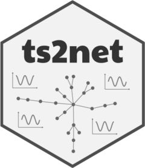

# ts2net 

:chart_with_upwards_trend: :point_right: :spider_web: :wink:

```ts2net``` is an R package to transform one or multiples time series into networks.

### Installation

To install the ```ts2net``` package, please run the following line in R:

``` r
install.packages("ts2net")
```

``` r
install.packages("remotes") # if you have not `remotes` package installed
remotes::install_github("lnferreira/ts2net")
```

### Reference

Please cite this paper if you used ```ts2net``` package in a publication.

```
@article{ts2net,
  title         = "ts2net: From Time Series to Networks in R",
  author        = "Ferreira, Leonardo N",
  month         =  Apr,
  year          =  2022,
  copyright     = "https://github.com/lnferreira/ts2net/blob/main/LICENSE.md",
  archivePrefix = "arXiv",
  primaryClass  = "",
  eprint        = ""
}
```

### License

```ts2net``` is distributed under [MIT license](LICENSE.md).

### Contact

Leonardo N. Ferreira  
[leonardoferreira.com](https://www.leonardoferreira.com/)  
:ferreira@leonardonascimento.com
