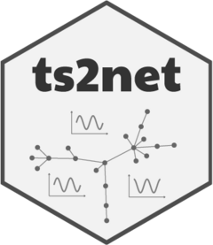

# ts2net 


```ts2net``` is an R package to transform one or multiples time series into networks. 

### Installation

To install the ```ts2net``` package, please run the following line in R:

``` r
install.packages("dataRetrieval")
```

``` r
install.packages("remotes") # if you have not installed "remotes" package
remotes::install_github("lnferreira/ts2net")
```

### Reference


### License

```ts2net``` is distributed under [MIT license](LICENSE.md).

### Contact

Leonardo N. Ferreira
[leonardoferreira.com](https://www.leonardoferreira.com/)

ferreira@leonardonascimento.com
